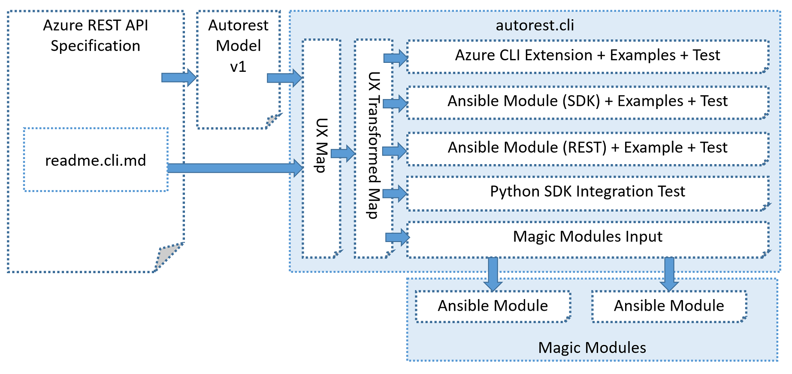

# Autorest.CLI Overview

## Goals

Goal of Autorest.CLI is to generate fully functional, high quality Azure CLI Commands / Extensions with minimal effort and additional metadata suppied:

- Default Azure CLI Extension can be generated from pure Swagger
- Common structure, option names, documentation and behaviour can be adjusted via **readme.cli.md** file
- Users of **autorest.cli** should be able to model their extension within hours - no ramp-up process should be required
- Examples from Azure REST API specs reused in other SDKs, integration tests and finally Azure CLI integration test
- Amount of metadata in **readme.cli.md** should be miminal
- Automatic generation / release pipeline aligned with other SDKs
- Output of **autorest.cli** can be reused by other downstream tools, like Ansible or Terraform

## Benefits

- Improve quality of Azure REST API specification's Examples (we are testing and normalizing examples in the same time)
- Improve quality of the services by introducing E2E testing befoe SDKs and Azure CLI is released
- No need to write examples manually for every SDK/tool separately
- No need to write integration tests manually for every SDK/tool separately
- Extremely high level of consistency between all supported tools (Azure CLI / Ansible / Terraform, etc.) as they will share the same naming conventions, structure of options and behaviour. Users can "convert" Azure CLI command into Ansible playbook without even reading documentation.
>NOTE: Historically Autorest.CLI was developed to generate Ansible modules

## Inputs

- Generic Azure REST API Specification (https://github.com/Azure/azure-rest-api-specs)
- Additional metadata in **readme.cli.md** file

## Phases of Operation

### Phase 1 - Generate Internal Map / Model

This step is fully automatic.
Unprocessed internal map is created.

### Phase 2 - Flatten Map and Add Adjustments

During this phase:
- fully automatic flattening of options is done
- all adjustments provided in **readme.cli.md** file are applied

### Phase 3 - Generate Azure CLI Extension

This is the final step of autogeneration.
Internal map is converted into actual Azure CLI extension source code.

## Outputs

- fully functional Azure CLI Extension
- examples generated from examples included in Azure REST API specification
- integration test generated from examples included in Azure REST API specification and supplementary metadata

## Additional Outputs (byproducts)

- Magic Modules input files that can be further used to generate Ansible and Terraform Modules
- Standard Ansible modules using Python SDK
- Lightweight Ansible modules using Azure REST API Directly
- Python Integration Test based on examples included in Azure REST API specification and suplementaty metadata
- Azure CLI Extension generation report
- Python Examples
- Rest examples for Azure CLI (**az rest** command)

## Sharing Implementation

||Azure CLI|Ansible|Terraform|
|-|-|-|-|
|Programming Language|Python|Python|Go|
|UX Structure|YES|YES|YES|
|Option Names|YES*|YES*|YES*|
|Common Code|YES**|YES**|-|
|Integration Test|YES|YES|YES|
|Examples|YES|YES|YES|

\* differences are minimal, for instance: **--resource-group** / **resource_group** / **resourceGroup**

\** Currently Azure CLI and Ansible have no common code as these tools were developed independently, however sharing implemenation can be considered as both use Python / Azure Python SDK

### Sharing Implementation between Azure CLI and Ansible

What can be shared?
- UX -> Azure Python SDK transformation
- Validators
- Authentication

