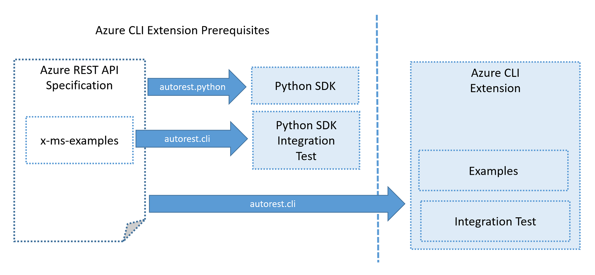

# Workflow

## Authoring Azure CLI Extension Using **autorest.cli**

### Step 1 - Swagger

Service specification must be merged into Azure REST API specification repositiory.

### Step 2 - Python SDK

Once specification is merged into Azure REST API specs, SDK releases are requested via OpenAPI Portal https://aka.ms/openapiportal.

### Step 3 - Python SDK Integration Test

This step can be done while generating Python SDK or afterwards.
Preferably it should be done at the same time, as it ensures quality of released SDK.

This is essential prerequisite for creating Azure CLI extension as it:
- ensures quality of the service itself
- ensures quality of released Python package
- ensures quality of examples provided along service definition

>NOTE: Examples and integration test will be used for Azure CLI Extension autogeneration

### Step 4 - Azure CLI Extension Prototype

Once step 4 is completed which includes:
- initial version of **readme.cli.md** file merged into master branch of Azure REST API specification
- Python SDK package integration tests generated and recorded
- Python package source code merged into Azure SDK for Python repository
- Python package released to pypi.org (optional)

to request extension generation, add **version** option to **readme.cli.md** file, for instance:

    cli:
      ...
      version: 0.1.0rc1

>NOTE: Below steps are not implemented yet. Currently extension needs to be generated manually.

Once **version** is present in **readme.cli.md** file, following steps will be performed automatically:
- Azure SDK Automation will generate pull request to Azure CLI Extensions repository
- If extension version is release candidate (version contains rc postfix **rcX** for instance **0.1.0rc1**), automation will produce a wheel and push just push it to temporary storage, and extension will be available for testing from following URL:

### Step 5 - Refining Extension

Once extension prototype is generated it can be easily tested using standard Azure CLI container. You can run following commands:

    docker run -it mcr.microsoft.com/azure-cli
    az extension add --source https://azurecliprod.blob.core.windows.net/cli-extensions/my_extensions-0.1.0rc1-py2.py3-none-any.whl
    az my-extension --help

>NOTE: Commands above should be added to the pull request generated in Azure CLI Extensions repository

After testing the extension author can decide to refine the structure, options or documentation. This can be done by makining changes to:
- Azure REST API specification
- Examples
- **readme.cli.md** file

>NOTE: Fixing issues (for instance documentation) should be done in Azure REST API specification. Additional metadata in **readme.cli.md** should be only added when fix is very specific to Azure CLI and changes can't be made in the specification itself.

### Step 6 - Publishing Extension

>NOTE: This part is in design stage

Once extension extension authoring is completed, it can be published.
In order to do that just remove release candidate prefix from the version in **readme.md** file (for instance change **0.1.0rc5** to **0.1.0**).
When this happens automation will not only produce new version of the wheel, but also create appropriate entry in **index.json** file. Once the PR is merged extension is published.

## Publishing Extension as Core Module

>NOTE: This part is under design

