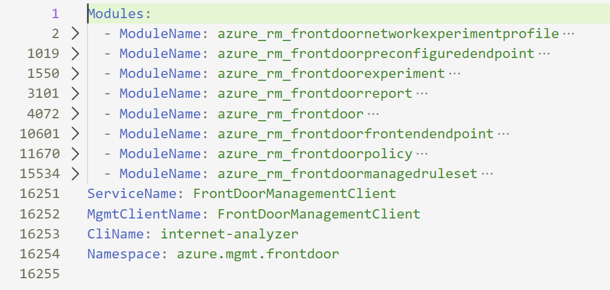
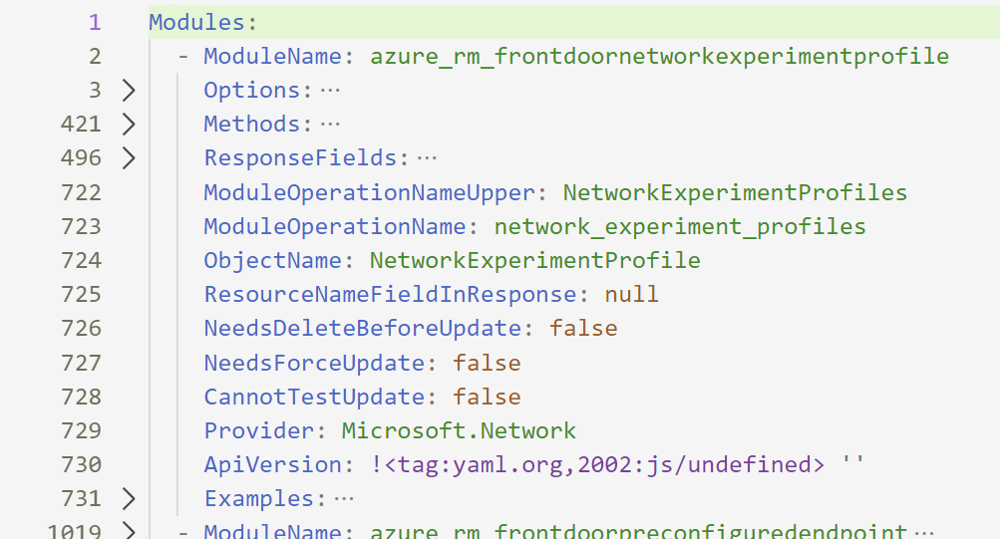
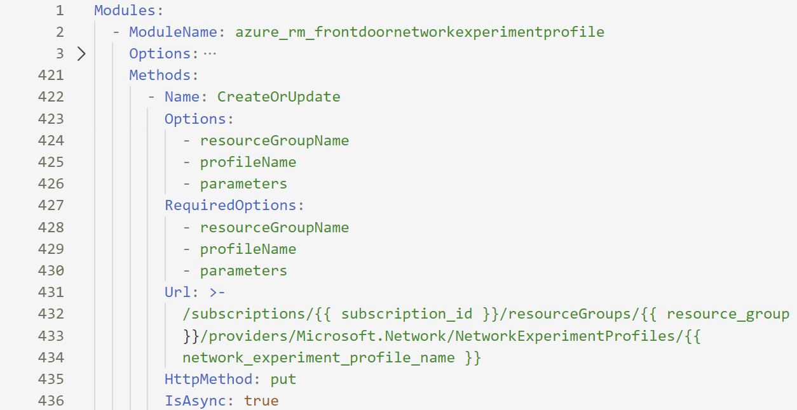

# Intermediate Map Reference

Intermediate Map is an intermediate internal structure and is used to generate all the other outputs, however it's designed to be higly readable by human.

>NOTE: This is an internal structure, and some of the fields may change in process of improving **autorest.cli**

## How to Get Intemediate File?

Intermediate files can be dumped by adding **--intermediate** option.

There are 2 types on intermediate file:

- unflattened - this is raw unprocessed map
- flattened - this is map with applied flattening and all additonal transformation

By comparing these 2 maps it's easy to see the effect of applied flattening and custom transformations.

## Top Level

At the top level map looks as below:

It contains a list of "modules" and a few additional top-level parameters:

>NOTE: **ModuleName** is an Ansible module name as it's **autorest.cli** was historically developed to generate Ansible modules. This should be changed in the future

## Modules

Every module entry combines CRUD operations related to one resource or sub-resource:

### Options

This is a combined list of options used by all the methods.

### Methods

Method structure looks as follows:

|Name|Description|
|----|-----------|
|Name|method name|
|Options|simply a list of method options referring **Options**|
|RequiredOptions|list of required options|
|Url|Azure REST API URL associated wth the method|
|HttpMethod|HTTP method|

### Examples

This section contains a list of examples.
